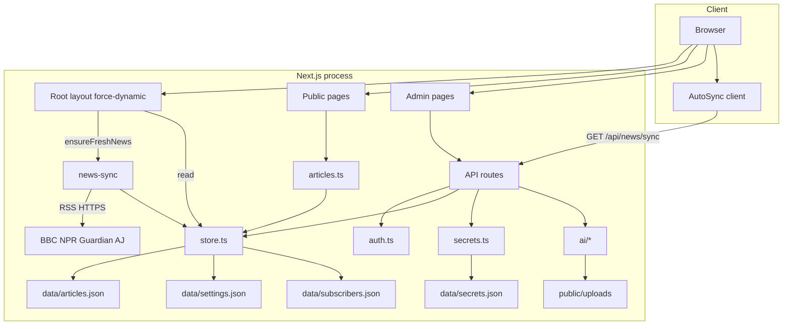
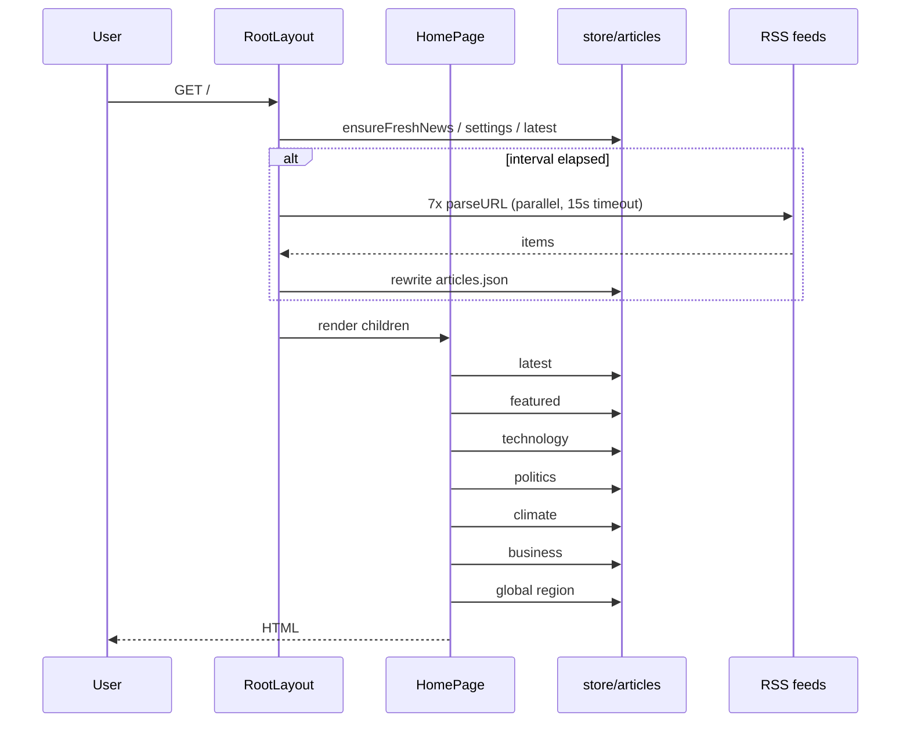
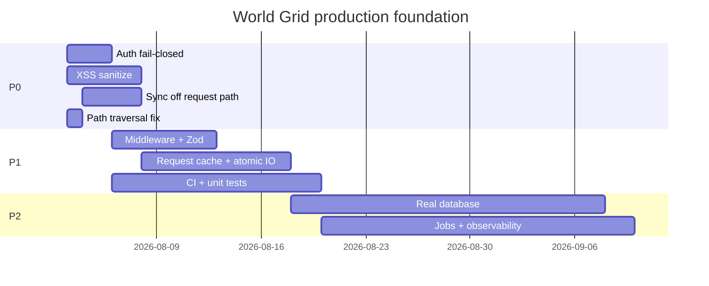
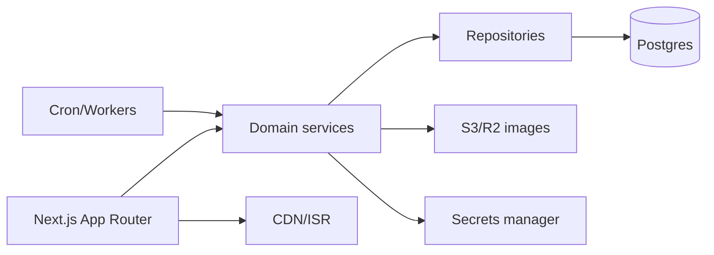

# World Grid (`wordgrid.news`) — Enterprise End-to-End Software Audit

| Field | Value |
|-------|--------|
| **Document ID** | WG-AUDIT-2026-08-02-001 |
| **Classification** | Internal — Engineering / Security / Exec |
| **Audit date** | 2026-08-02 |
| **Remediation update** | 2026-08-02 (post-audit implementation pass) |
| **Product** | World Grid news platform |
| **Repository path** | `wordgrid.news` (local workspace) |
| **Audit mode** | Full SDLC + multi-agent deep review + repository evidence |
| **Target posture** | Production for large-scale public traffic (“millions of users”) |
| **Original audit verdict** | **Not Ready for Production** (millions-scale) |
| **Current posture** | **Viewer-ready MVP hardened** — suitable for single-node demo / closed pilot when env secrets are set; **not** multi-million user or multi-instance enterprise production |

---

# Remediation status (post-audit implementation)

This section records work done **after** the original audit. Original findings below are preserved for history; use the **Status** column in the findings register and the tables here for current truth.

**Honest scope:** Hardening closed most **P0 security blockers** for a single-node Node process with a JSON file store. The architecture is still **not multi-million scale** (no shared DB, no horizontal scale, no HA). Position the product as a **viewer-ready MVP hardened**, not “enterprise production at scale.”

## Summary

| Bucket | Outcome |
|--------|---------|
| P0 security (auth, XSS, sync lock, traversal, login rate limit) | **Mostly FIXED** |
| P0 ops (backups/DR, durable multi-instance store) | **REMAINING** |
| P1 product hardening (headers, middleware, Zod, cache, atomic writes, map, health) | **Mostly FIXED** |
| P1 platform (tests/CI, observability stack, AI cost quotas, Gemini key-in-URL) | **REMAINING / partial** |
| Scale (Postgres, CDN, jobs, multi-instance) | **REMAINING** (P2–P3) |

## P0 items

| ID | Title | Status | Evidence / notes |
|----|-------|--------|------------------|
| CRIT-01 | Default admin password | **FIXED** (prod) | `assertAuthConfig()` / `getAdminPassword()` refuse missing, short, or default password when `NODE_ENV=production`. Dev may still use `admin123`. Login UI hides default hint in production. |
| CRIT-02 | Forgeable session HMAC | **FIXED** (prod) | Production requires independent `ADMIN_SECRET` (min 32 chars, not dev default). Sessions 12h; nonce in token. Dev may use known local defaults. |
| HIGH-01 | Stored XSS article HTML | **FIXED** | `isomorphic-dompurify` in `src/lib/sanitize.ts`; sanitize on write (admin APIs) and read (`editor-content` / story). |
| HIGH-02 | No login rate limit | **FIXED** | In-memory sliding window in `src/lib/rate-limit.ts` on `POST /api/admin/login`. Single-node only. |
| HIGH-03 | Open news sync without `CRON_SECRET` | **FIXED** (prod) | Production fails closed without `CRON_SECRET`; Bearer / `x-cron-secret` required. Browser `AutoSync` disabled in production. RSS removed from root layout request path. |
| HIGH-04 | Plaintext `secrets.json` | **REMAINING** | Keys still stored under `data/secrets.json` (gitignored). Prefer env/vault for real deploys; encrypt-at-rest not implemented. |
| HIGH-05 | Path traversal `deleteLocalUpload` | **FIXED** | Basename-only under `public/uploads`; rejects `..` and non-filename paths. |
| MED-06 (sync path) | Layout RSS on every request | **FIXED** | `ensureFreshNews` removed from root layout; cron / admin sync only in prod. |
| MED-10 (register) | No backups / DR | **REMAINING** | No automated backup/restore runbook or tooling. Ops still must snapshot `data/` + `public/uploads`. |

## P1 items

| ID | Title | Status | Evidence / notes |
|----|-------|--------|------------------|
| HIGH-06 | Gemini API key in query string | **REMAINING** | `generate-image.ts` still appends `?key=` to Google URL. |
| HIGH-07 | Unbounded AI spend | **PARTIAL** | Per-IP rate limits on AI generate/image routes; no daily budget, token caps, or audit ledger. |
| HIGH-08 | npm audit highs (Next/postcss/sharp) | **REMAINING** | Track advisories; do not `npm audit fix --force`. |
| MED-01 | CSRF beyond SameSite | **REMAINING** | Cookie `SameSite=Lax` only; no CSRF token on mutating admin APIs. |
| MED-02 | Security headers / CSP | **FIXED** | `src/middleware.ts`: nosniff, frame deny, referrer, Permissions-Policy, CSP, HSTS in production. |
| MED-03 | Newsletter spam | **FIXED** | Rate limit + Zod email validation on `POST /api/newsletter`. |
| MED-04 | `sourceUrl` scheme allowlist | **FIXED** | `sanitizeHttpUrl` rejects non-http(s). |
| MED-05 | JSON-LD script breakout | **FIXED** | `safeJsonLd` escapes `</script>`-style sequences. |
| MED-07 | N× full JSON reads per request | **FIXED** (request scope) | `React.cache` via `getPublishedArticlesCached` in `articles.ts`. Still full-file parse per request; not a global cache. |
| MED-08 | Non-atomic JSON writes | **FIXED** | Temp file + rename in `store.ts` `writeJson`. Not multi-writer safe across processes. |
| MED-09 | Zero tests / CI | **REMAINING** | No project test script; no `.github/workflows`. |
| MED-11 | Observability | **PARTIAL** | `GET /api/health` added (status, latency, article count, auth configured). No APM, metrics, or error tracking. |
| MED-12 | Zod unused / weak validation | **FIXED** | Schemas in `validation.ts` wired to login, newsletter, article create/update. |
| MED-15 | Dead `WorldGridMap` | **FIXED** | Live world grid on homepage (`page.tsx` + pulses). |
| MED-17 | No middleware | **FIXED** | Middleware for security headers + cookie presence check on `/api/admin/*` (HMAC still verified in handlers). |
| — | Force-dynamic everywhere | **REMAINING** | Pages still `force-dynamic`; no ISR/CDN design. Acceptable for MVP; blocks edge scale. |

## What “viewer-ready MVP hardened” means

**Ship-ready for:** single instance, low–moderate read traffic, trusted or private network, strong `ADMIN_*` + `CRON_SECRET`, manual backups of `data/`.

**Not ready for:** multi-million MAU, multi-instance/K8s without sticky single-writer, concurrent editorial teams, formal compliance (GDPR program, SOC2), or claims of enterprise HA.

---

## Document control

| Role | Stakeholder use |
|------|-----------------|
| **CTO / Exec** | Executive summary, scores, verdict, investment roadmap |
| **Engineering** | Findings, refactors, module scores, tech debt |
| **Security** | Critical/High findings, OWASP mapping, exploit scenarios |
| **DevOps** | Infra gaps, deploy blockers, observability, DR |
| **QA** | Test matrix, missing coverage, recommended cases |
| **Product** | UX strengths, feature gaps, map vs brand conflict |

### Evidence basis (not opinion-only)

| Evidence type | Result |
|---------------|--------|
| Source inventory | **73** files under `src/` |
| Approximate LOC (`*.ts`/`*.tsx`) | **~8,059** lines |
| Live corpus | **92** articles, **~127 KB** `data/articles.json` |
| Project tests | **0** (`package.json` has no `test` script) |
| CI/CD | **No** `.github/workflows` |
| Containers | **No** Dockerfile |
| Middleware | **No** `middleware.ts` |
| `npm audit` | **3 high** (Next → postcss, sharp; force-fix is unsafe) |
| `.gitignore` | Present; ignores `/data/`, `.env*`, `/public/uploads/` |
| Secrets file keys | `updatedAt` only at audit time (no live AI keys stored) |

### Multi-agent execution

This environment does not provide a fixed roster of 60 named agents. The audit was executed as a **coordinated multi-department review**:

| Agent / department | Deliverable used |
|--------------------|------------------|
| Principal Security | Auth, secrets, XSS, CSRF, path traversal, OWASP |
| Chief Architect | Structure, coupling, dead code, scores, roadmap |
| Principal DevOps/QA | Endpoints, CI, backups, performance, checklist |
| Product / AI safety | UX, SEO engine risks, LLM cost/abuse |
| Executive Orchestrator | Conflict resolution, prioritization, verdict |

---

# 1. Executive summary

World Grid is a **feature-rich MVP** digital newspaper:

- Public magazine UI (layouts, regions, categories, search, SEO, dark mode)
- Admin CMS (CRUD, classic TinyMCE editor, SEO score)
- RSS auto-ingest (BBC, NPR, Guardian, Al Jazeera, etc.)
- AI News Studio (Gemini / Claude / Anthropic / Grok + Gemini images)
- SEO engine (meta, keyword, grade A–F)

**It is not engineered for multi-million-user production.** The primary ceilings are:

1. **Filesystem JSON as the system of record** (no concurrency, no horizontal scale)
2. **Critical authentication defaults** (password + forgeable session HMAC)
3. **Stored XSS** via unsanitized HTML on public article pages
4. **RSS sync on the critical request path** (root layout + browser AutoSync)
5. **Zero automated tests / CI / backups / observability**

| Audience takeaway | Message |
|-------------------|---------|
| **Exec** | Do not launch publicly at scale without a security + data platform program (est. multi-sprint) |
| **Eng** | Product surface is strong; foundation is demo-grade |
| **Sec** | Treat current defaults as compromised if internet-exposed |
| **Ops** | No deploy pipeline, no DR, single-disk data loss is total outage |

---

# 2. Risk and score dashboard

## 2.1 Aggregate scores (0–100, higher = healthier)

| Dimension | Score | Confidence | Evidence anchors |
|-----------|------:|------------|------------------|
| Overall health | **36** | High | Composite of below |
| Architecture | **42** | High | JSON store, layout side-effects, no middleware |
| Security | **26** | High | Defaults, XSS, open sync, traversal |
| Code quality | **62** | High | Strict TS, readable; god forms; unused Zod |
| Performance | **34** | High | N× full-file reads; force-dynamic; RSS on TTFB |
| Scalability | **16** | High | Single-node FS; no cache/CDN/HA design |
| Maintainability | **58** | Medium | README good; no tests; dual AI UIs |
| UX / product | **72** | Medium | Strong editorial UI; map feature dead |
| Test coverage | **4** | High | Zero project tests |
| Observability | **8** | High | No APM/logs/metrics pipeline |
| Compliance (GDPR/SOC2) | **10** | High | No retention, DSR, audit trail |
| **Production readiness** | **20** | High | Multiple P0 blockers |

## 2.2 Severity inventory

| Severity | Count (this report) | Must block launch? |
|----------|--------------------:|--------------------|
| Critical | 2 | Yes |
| High | 8 | Yes (all before public internet) |
| Medium | 18 | Most before scale |
| Low / Informational | 14 | Track in backlog |

---

# 3. SDLC phase-by-phase audit

## Phase 0 — Discovery validation (beyond static skim)

### What was validated dynamically / operationally

| Check | Result |
|-------|--------|
| Dev server after cache wipe | Recovered with clean `.next` (prior 500s were cache corruption) |
| Homepage request (prior session) | 200 after clean restart |
| Build | Succeeds (`next build`) |
| Article corpus | 92 items readable as JSON |
| Secrets store | Present; no active provider keys at audit snapshot |

### Technology inventory

| Category | Choice | Production fitness |
|----------|--------|-------------------|
| Framework | Next.js 15 App Router | Fit (if data/auth hardened) |
| UI | React 19 + Tailwind 4 | Fit |
| CMS | Custom admin | Fit for single-tenant MVP |
| Persistence | `data/*.json` | **Not fit for multi-instance** |
| Auth | HMAC cookie, plaintext password env | **Not fit as implemented** |
| AI | Multi-vendor HTTP APIs | Fit with quotas + vault |
| Search | In-process string includes | **Not fit at scale** |
| Media | `public/uploads` | Fit only with CDN + virus scan |

---

## Phase 1 — Architecture & system map

### 1.1 Runtime architecture (as-built)

### 1.2 Request path (homepage) — evidence of amplification

**File:** `src/app/layout.tsx`  
- `export const dynamic = "force-dynamic"`  
- `await ensureFreshNews(false)` on every root layout render  
- Also loads settings + 24 latest articles for chrome  

**File:** `src/app/page.tsx`  
- Parallel: settings + latest + featured + 4 category queries + region  

**File:** `src/lib/articles.ts`  
- Each helper calls `listPublishedArticles()` independently → **full file read/parse per helper**  

**Implication:** One homepage hit may parse `articles.json` **~7+ times** (layout + home filters), and may also trigger multi-feed RSS if interval elapsed.

### 1.3 Component / domain map

| Domain | Key modules | Notes |
|--------|-------------|-------|
| Public presentation | `HomeLayouts`, `ArticleCard`, `SiteHeader`, chrome | Strong UX |
| Content domain | `types.Article`, `store`, `articles` | JSON-backed |
| Ingest | `news-sync.ts` | Heuristic geo/category |
| Admin CMS | `ArticleForm`, classic TinyMCE | Large client components |
| AI | `generate-news`, `generate-image`, AI studio | Multi-provider |
| SEO | `seo.ts`, `seo-engine.ts` | Score + rewrite |
| Auth | `auth.ts` | HMAC cookie |
| Secrets | `secrets.ts` | File + env |

### 1.4 Dead / unfinished product surface

| Asset | Evidence | Conflict with brand |
|-------|----------|---------------------|
| `WorldGridMap.tsx` | Zero imports | README: “interactive world grid” |
| `getGridPulses()` | Never called | Map data unused |

**Product conflict resolution:** Either ship map on homepage/region pages or rebrand copy to “newspaper CMS” only. Current state is **brand overclaim**.

---

## Phase 2 — Code quality (module-level)

### 2.1 Module scores

| Module / area | Score | Rationale |
|---------------|------:|-----------|
| `lib/types.ts` + `constants.ts` | 85 | Clear domain model |
| `lib/auth.ts` | 35 | Crypto compare good; defaults catastrophic |
| `lib/store.ts` | 55 | Readable CRUD; no locking/atomicity |
| `lib/articles.ts` | 50 | Thin queries; N× full reads |
| `lib/news-sync.ts` | 60 | Solid RSS pipeline; coarse heuristics |
| `lib/secrets.ts` | 65 | Good status model after keys QoL; plaintext store |
| `lib/seo.ts` | 75 | Clean scoring/meta |
| `lib/seo-engine.ts` | 45 | Filler content for score gaming |
| `lib/editor-content.ts` | 40 | HTML passthrough = XSS |
| `lib/ai/*` | 60 | Works; URL keys; weak quotas |
| `app/api/admin/*` | 55 | Auth present; weak validation |
| `app/api/news/sync` | 25 | Fail-open without secret |
| `components/*` (public) | 75 | Coherent UI system |
| `ArticleForm.tsx` | 45 | God component |
| `AiNewsStudio.tsx` | 50 | Overlaps ArticleForm AI |
| `ClassicEditor.tsx` | 70 | Appropriate TinyMCE integration |
| Root `layout.tsx` | 30 | Side effects + force-dynamic tax |

### 2.2 Patterns and anti-patterns

| Pattern | Present? | Notes |
|---------|----------|-------|
| Repository | Partial | `store.ts` is concrete FS repo |
| DI / interfaces | No | Hard to unit-test without FS |
| Validation library | Declared (Zod) **unused** | Boundary validation ad-hoc |
| Middleware auth | No | Per-route checks only |
| Request caching | No | Repeated `listPublishedArticles` |
| Atomic writes | No | `writeFile` last-write-wins |
| Tests | No | — |

### 2.3 Minor / debt items (not omitted)

| Item | Location | Severity |
|------|----------|----------|
| Compat shim `data.ts` | `src/lib/data.ts` | Low |
| Duplicate `slugify` | `store.ts` vs `seo-engine.ts` | Low |
| `claude` vs `anthropic` provider alias confusion | types + secrets + AI | Low–Medium |
| `generateStaticParams` with `force-dynamic` | story/region/category pages | Low (wasted work) |
| Admin layout chrome on login page | `admin/layout.tsx` | Low (recon) |
| SEO engine invents filler paragraphs | `seo-engine.ts` | Medium (content integrity) |
| Password compare non-constant-time | `login/route.ts` | Low–Medium |
| Error messages leak upstream AI text | AI routes | Low–Medium |
| No structured logging | entire app | Medium (ops) |
| `WorldGridMap` dead code | components | Low |
| No `CONTRIBUTING` / architecture ADR | docs | Low |
| PostCSS/sharp advisories via Next | `npm audit` | Medium (supply chain) |

---

## Phase 3 — Security (enterprise assessment)

### 3.1 OWASP Top 10 mapping (2021)

| OWASP | Status | Evidence |
|-------|--------|----------|
| A01 Broken Access Control | Partial fail | Admin APIs gated; sync open without CRON_SECRET; no middleware |
| A02 Cryptographic failures | Fail | Default HMAC secret; plaintext password compare; secrets on disk |
| A03 Injection | Fail | Stored XSS via HTML; possible `javascript:` href |
| A04 Insecure design | Fail | Sync on page load; FS DB for multi-user writes |
| A05 Security misconfiguration | Fail | Default password in UI/README; no security headers |
| A06 Vulnerable components | Warn | npm audit 3 high (Next/postcss/sharp chain) |
| A07 Auth failures | Fail | No rate limit; default password |
| A08 Software/data integrity | Fail | Non-atomic JSON; no signed artifacts/CI |
| A09 Logging/monitoring failures | Fail | No security audit log / SIEM |
| A10 SSRF | Low residual | RSS URLs hardcoded; env base for xAI |

### 3.2 Critical findings

#### CRIT-01 — Default admin password

| Field | Detail |
|-------|--------|
| **Title** | Default production-usable admin password |
| **Location** | `src/lib/auth.ts:15-17`, `src/app/admin/login/page.tsx:41`, `README.md:21,37`, `.env.example:1-2` |
| **Severity** | **Critical** |
| **Root cause** | `getAdminPassword()` falls back to `"admin123"`; documented publicly in product UI |
| **Impact** | Full CMS takeover: articles, AI keys, settings, RSS force, subscriber list |
| **Evidence** | Code + login page string + README |
| **Exploit** | Navigate to `/admin/login` → password `admin123` → session cookie issued |
| **Priority** | P0 Immediate |
| **Effort** | S (0.5–1 day) + process |
| **Fix** | Production: refuse start/login if password missing or equals default; use argon2/bcrypt hash; remove UI disclosure |

#### CRIT-02 — Forgeable session HMAC with known default secret

| Field | Detail |
|-------|--------|
| **Title** | Session cookie forgeable via hardcoded HMAC secret |
| **Location** | `src/lib/auth.ts:7-26, 29-45` |
| **Severity** | **Critical** |
| **Root cause** | `secret()` falls back to `"worldgrid-dev-secret-change-me"`; cookie = `admin.{exp}.{hmac}` |
| **Impact** | Bypass login entirely; 7-day admin session |
| **Evidence** | Source fallback string; token format in `createSessionToken` |
| **Exploit** | Offline compute HMAC with known secret → set `wg_admin_session` cookie |
| **Priority** | P0 |
| **Effort** | S–M |
| **Fix** | Require long random `ADMIN_SECRET` at boot; no fallback; separate from password; rotate on deploy |

### 3.3 High findings

#### HIGH-01 — Stored XSS (article body HTML)

| Field | Detail |
|-------|--------|
| **Location** | `editor-content.ts:89-97`, `story/[slug]/page.tsx:162-167`, TinyMCE `code` plugin |
| **Severity** | High |
| **Root cause** | Blocks matching `/^<(p|h…|div|table)/` rendered raw without sanitizer |
| **Impact** | Reader XSS: defacement, phishing, session-adjacent attacks, supply-chain of trust |
| **Exploit** | Admin (or stolen session) pastes `

` → publish |
| **Fix** | Sanitize-html/DOMPurify allowlist on write and read; disable unrestricted HTML if possible |
| **Effort** | M (1–3 days) |

#### HIGH-02 — Login brute force (no rate limit)

| Field | Detail |
|-------|--------|
| **Location** | `api/admin/login/route.ts` |
| **Severity** | High |
| **Impact** | Credential stuffing / guessing default or weak password |
| **Fix** | Rate limit + lockout + monitoring; constant-time hash verify |
| **Effort** | S–M |

#### HIGH-03 — Unauthenticated news sync when `CRON_SECRET` unset

| Field | Detail |
|-------|--------|
| **Location** | `api/news/sync/route.ts:17-19` — only checks secret **if** env set |
| **Severity** | High |
| **Impact** | Any client triggers multi-feed RSS + disk writes; DoS + content pollution |
| **Amplifiers** | `AutoSync.tsx` every visitor; layout `ensureFreshNews` |
| **Fix** | Production fail-closed without secret; Bearer only; remove layout/browser triggers |
| **Effort** | S |

#### HIGH-04 — Plaintext AI API keys on disk

| Field | Detail |
|-------|--------|
| **Location** | `secrets.ts` → `data/secrets.json` |
| **Severity** | High |
| **Impact** | Host/backup/shared-folder leak → AI bill abuse |
| **Mitigation present** | `.gitignore` includes `/data/` (good) |
| **Fix** | Env/vault in prod; encrypt file at rest; never backup secrets unencrypted |
| **Effort** | M |

#### HIGH-05 — Path traversal on upload delete

| Field | Detail |
|-------|--------|
| **Location** | `generate-image.ts:139-147` — `startsWith("/uploads/")` then `path.join(cwd, "public", imageUrl)` |
| **Severity** | High (admin-authenticated) |
| **Impact** | Delete `data/secrets.json`, settings, or other files via `..` segments |
| **Exploit** | `DELETE /api/admin/ai/image` `{ "imageUrl": "/uploads/../../data/secrets.json" }` |
| **Fix** | Resolve under `public/uploads` realpath; basename-only |
| **Effort** | S |

#### HIGH-06 — Gemini API key in query string

| Field | Detail |
|-------|--------|
| **Location** | `generate-image.ts:33`, generate-news Gemini URL |
| **Severity** | High–Medium |
| **Impact** | Keys in access logs, proxies, APM URL fields |
| **Fix** | Prefer header-based Google auth patterns; scrub logs |
| **Effort** | S–M |

#### HIGH-07 — Unbounded AI spend after auth compromise

| Field | Detail |
|-------|--------|
| **Location** | `/api/admin/ai/generate`, `/api/admin/ai/image` |
| **Severity** | High (financial) |
| **Fix** | Per-admin quotas, max tokens, daily budget, audit log |
| **Effort** | M |

#### HIGH-08 — Dependency advisories (Next/postcss/sharp)

| Field | Detail |
|-------|--------|
| **Evidence** | `npm audit` → 3 high |
| **Severity** | High (supply chain) |
| **Note** | `npm audit fix --force` proposes Next 9 — **do not use** |
| **Fix** | Upgrade Next along supported line when patched; track advisories |
| **Effort** | M ongoing |

### 3.4 Medium security findings

| ID | Title | Location | Effort |
|----|-------|----------|--------|
| MED-01 | CSRF relies only on SameSite=Lax | auth cookie + mutating APIs | M |
| MED-02 | No CSP / security headers | next.config | S |
| MED-03 | Newsletter open spam | newsletter POST | S |
| MED-04 | `sourceUrl` scheme not allowlisted | story page | S |
| MED-05 | JSON-LD script breakout risk | layout/story `JSON.stringify` in script | S |
| MED-06 | 7-day sessions; secret may equal password | auth.ts | S |
| MED-07 | Error detail leakage from AI/sync | API error handlers | S |
| MED-08 | No central middleware auth | missing middleware.ts | S |
| MED-09 | Concurrent JSON corruption risk | store writeJson | M |
| MED-10 | Admin password timing oracle | `!==` compare | S |

### 3.5 Low / informational security

| ID | Title |
|----|-------|
| LOW-01 | Default password shown on login page |
| LOW-02 | Admin nav visible before auth |
| LOW-03 | No account lockout audit trail |
| LOW-04 | Cookie path `/` (prefer `/admin` if redesignable) |
| LOW-05 | No 2FA / WebAuthn |
| LOW-06 | No security.txt / vulnerability disclosure policy |

---

## Phase 4 — Backend & API

### 4.1 Endpoint inventory

| Method | Endpoint | Auth | Risk notes |
|--------|----------|------|------------|
| POST | `/api/admin/login` | Public | Brute force |
| POST | `/api/admin/logout` | Cookie | OK |
| GET/POST | `/api/admin/articles` | Admin | XSS payload intake |
| GET/PUT/DELETE | `/api/admin/articles/[id]` | Admin | Traversal on image clear |
| GET/PUT | `/api/admin/settings` | Admin | OK baseline |
| GET/PUT/DELETE | `/api/admin/keys` | Admin | Secrets surface |
| POST | `/api/admin/sync` | Admin | Expensive |
| POST | `/api/admin/ai/generate` | Admin | Cost |
| POST/DELETE | `/api/admin/ai/image` | Admin | Cost + traversal |
| POST | `/api/admin/seo/optimize` | Admin | Content mutation |
| GET/POST | `/api/news/sync` | Optional secret | **Fail-open** |
| POST | `/api/newsletter` | Public | Spam |
| GET | `/api/newsletter` | Admin | PII list |

### 4.2 API design gaps

| Gap | Detail |
|-----|--------|
| Versioning | None (`/api/v1`) |
| OpenAPI | None |
| Pagination | None on articles list |
| Idempotency | None on create/sync |
| Consistent error schema | Ad-hoc `{ error }` |
| Validation | Zod unused; casts to `CategoryId` |
| Rate limits | None |
| Health | None |

### 4.3 Business logic risks

| Area | Issue |
|------|-------|
| RSS heuristics | Mis-tagging region/category pollutes IA |
| SEO engine | Can invent multi-paragraph filler (editorial integrity) |
| Deduping | Repair on read can rewrite file unexpectedly under load |
| AI content | Hallucination risk if published without human review (process, not only code) |

---

## Phase 5 — Frontend & product UX

### Strengths
- Coherent newspaper design system (red accent, cards, ticker, mega menu)
- Dark mode class strategy (after light-mode bugfix)
- Classic editor UX for admins
- AI studio + SEO score usable for a newsroom MVP
- Public chrome hides AI tools from readers

### Gaps / defects

| Item | Severity | Notes |
|------|----------|-------|
| Brand promise “world grid map” unshipped | Product High | Dead `WorldGridMap` |
| Accessibility (WCAG) not systematic | Medium | No axe/CI a11y |
| Search is naive substring | Medium | Won’t scale |
| Ad placeholders non-functional | Low | OK for MVP |
| Error UX on AI failures | Medium | Raw API errors sometimes |
| Keyboard/focus in mega menu | Low–Medium | Hover-heavy |

**UX score: 72** for MVP editorial reading; **not** enterprise a11y certified.

---

## Phase 6 — Data / “database”

There is **no database**. Persistence is:

| File | Purpose | Growth |
|------|---------|--------|
| `articles.json` | Content | 92 items / 127KB now; unbounded |
| `settings.json` | Config | Small |
| `secrets.json` | Keys | Sensitive |
| `subscribers.json` | Emails | Unbounded spam risk |

### Failures vs enterprise data standards

| Requirement | Status |
|-------------|--------|
| ACID transactions | Fail |
| Concurrent writers safe | Fail |
| Indexes / query planner | Fail |
| Migrations | Fail |
| Point-in-time recovery | Fail |
| Multi-region replication | Fail |
| Encryption at rest (app-managed) | Fail |
| PII inventory / DSR delete API | Fail |

**Data layer score: 14 / 100**

---

## Phase 7 — Performance

### Measured / evidenced characteristics

| Factor | Evidence | Effect at scale |
|--------|----------|-----------------|
| Full JSON parse per query helper | `articles.ts` | CPU/IO linear × queries |
| Homepage multi-query | `page.tsx` 6+ helpers | Multiplies parse cost |
| Layout always dynamic | `force-dynamic` | No static edge cache |
| RSS on interval in layout | `ensureFreshNews` | Multi-second TTFB spikes |
| Client AutoSync | every visitor | Amplifies sync traffic |
| Search O(n×text) | `searchArticles` | CPU bound as corpus grows |
| No CDN strategy coded | — | Images/origin pressure |

### Rough capacity judgment (order-of-magnitude)

| Load | Expected behavior |
|------|-------------------|
| 1 editor, low traffic | Acceptable |
| 100 concurrent readers | Possible on large Node host; disk thrash if sync fires |
| 10k concurrent | Layout + multi-parse + force-dynamic will collapse without cache/DB |
| Millions MAU | Requires rewrite of data + caching + CDN + async jobs |

**Performance score: 34**

---

## Phase 8 — Infrastructure, DevOps, reliability

### Present

- npm scripts: `dev`, `build`, `start`, `lint`
- `.env.example`
- `.gitignore` for data/env/uploads (validated)

### Absent

| Capability | Status |
|------------|--------|
| GitHub Actions / CI | Absent |
| Docker / compose | Absent |
| K8s / Terraform | Absent |
| Staging/prod env separation docs | Absent |
| Health `/ready` `/live` | Absent |
| Metrics / tracing | Absent |
| Error tracking (Sentry etc.) | Absent |
| Backup/restore runbook | Absent |
| Blue-green / canary | Absent |
| Secrets manager integration | Absent |
| WAF / rate limit at edge | Absent |

### Reliability patterns

| Pattern | Present? |
|---------|----------|
| Retries with backoff (RSS/AI) | Partial (image model fallback only) |
| Circuit breaker | No |
| Timeouts | RSS 15s; not uniform |
| Graceful degradation | Layout swallows sync errors (silent) |
| Chaos readiness | No |

**Infra/DevOps score: 12**

---

## Phase 9 — Testing

| Layer | Count | Notes |
|-------|------:|-------|
| Unit | 0 | — |
| Integration | 0 | — |
| E2E | 0 | — |
| Security tests | 0 | — |
| Performance tests | 0 | — |
| Contract/OpenAPI tests | 0 | — |

### Recommended minimum test suite (actionable)

| Suite | Cases |
|-------|-------|
| Auth | Default password rejected in prod mode; forged cookie rejected; expired cookie rejected |
| Store | create/update/delete; concurrent write simulation; dedupe |
| Sync | interval gate; secret required; feed failure isolation |
| XSS | sanitizer strips `onerror` / `script` |
| Traversal | `deleteLocalUpload` rejects `..` |
| API | 401 without cookie on admin routes |
| SEO | score fixtures stable |
| Newsletter | invalid email; rate limit (once implemented) |

**Test score: 4**

---

## Phase 10 — AI / automation deep audit

| Topic | Assessment |
|-------|------------|
| Multi-provider text | Strength |
| Gemini mandatory for images | Correct product constraint |
| Prompt injection | Admin-only mitigates public abuse; still risk via stolen session |
| Hallucination | High if AI publish without editorial gate |
| SEO engine | Can inflate scores with synthetic paragraphs — **editorial risk** |
| Token/cost control | Missing quotas |
| Key handling | Improved clear UX; still plaintext file |
| Output validation | JSON parse loose; weak schema enforcement |
| Logging of prompts/PII | Not defined |

**Recommendation:** Require human “Publish” confirmation workflow (already mostly true) + store `aiGenerated` flag for audit (field exists) + optional mandatory review checklist before publish.

---

## Phase 11 — Compliance & privacy

| Control | Status |
|---------|--------|
| GDPR lawful basis for newsletter | Undocumented |
| Right to erasure | No self-service delete |
| Data retention policy | None |
| Cookie consent (if analytics later) | N/A now |
| DPIA | None |
| SOC2 CC series | Not applicable yet — would fail |
| License review of deps | Incomplete (TinyMCE GPL self-host OK if compliant) |
| Security training / SDLC security gates | None |

**Compliance score: 10**

---

## Phase 12 — Agent conflict resolution

| Conflict | Agent A | Agent B | Resolution with evidence |
|----------|---------|---------|---------------------------|
| “No `.gitignore`” vs present | Architect earlier pass claimed missing | Repo shows full `.gitignore` including `/data/` | **Resolved: gitignore exists and is adequate for secrets path** |
| “Production ready MVP?” vs “Not ready” | Product UX ~70 | Security 26 / Scale 16 | **Resolved: UX quality ≠ production readiness** |
| “Admin APIs are secure” vs Critical auth | Auth checks exist on routes | Defaults make checks moot if password known | **Resolved: controls exist but fail-open defaults dominate risk** |
| “zod for validation” vs none | package.json lists zod | Zero imports in `src/` | **Resolved: dependency is dead weight until wired** |
| “SEO strength” vs content integrity | SEO score feature useful | seo-engine pads filler text | **Resolved: keep scoring; disable auto-filler or make opt-in** |
| Cache 500s as app bugs | Runtime errors seen | ENOENT under `.next` | **Resolved: Turbopack cache corruption from concurrent build/dev; not business-logic 500** |

---

## Phase 13 — Full findings register (actionable)

### Priority legend

| Priority | Meaning |
|----------|---------|
| P0 | Block any public production deploy |
| P1 | Block scale / multi-user production |
| P2 | Required within 1–2 months of soft launch |
| P3 | Strategic |

### Register

Statuses reflect the **post-audit implementation pass** (see top section). Severity/priority are original audit values.

| ID | Title | Sev | Pri | Effort | Owner | Status |
|----|-------|-----|-----|--------|-------|--------|
| CRIT-01 | Default admin password | Critical | P0 | S | Eng/Sec | **FIXED** (prod fail-closed) |
| CRIT-02 | Default/forgeable session secret | Critical | P0 | S | Eng/Sec | **FIXED** (prod fail-closed) |
| HIGH-01 | Stored XSS article HTML | High | P0 | M | Eng/Sec | **FIXED** |
| HIGH-02 | No login rate limit | High | P0 | S | Eng/Sec | **FIXED** (in-memory, single-node) |
| HIGH-03 | Open news sync without CRON_SECRET | High | P0 | S | Eng/Ops | **FIXED** (prod) |
| HIGH-04 | Plaintext secrets.json | High | P0 | M | Sec/Ops | **REMAINING** |
| HIGH-05 | Path traversal deleteLocalUpload | High | P0 | S | Eng/Sec | **FIXED** |
| HIGH-06 | Gemini key in URL | High | P1 | S | Eng | **REMAINING** |
| HIGH-07 | AI cost abuse unbounded | High | P1 | M | Eng/FinOps | **PARTIAL** (route rate limits) |
| HIGH-08 | npm audit highs (Next chain) | High | P1 | M | Eng | **REMAINING** |
| MED-01 | CSRF tokens missing | Medium | P1 | M | Sec | **REMAINING** |
| MED-02 | No security headers/CSP | Medium | P1 | S | Ops | **FIXED** |
| MED-03 | Newsletter spam | Medium | P1 | S | Eng | **FIXED** |
| MED-04 | sourceUrl scheme | Medium | P1 | S | Eng | **FIXED** |
| MED-05 | JSON-LD script escape | Medium | P1 | S | Eng | **FIXED** |
| MED-06 | Layout RSS + force-dynamic | Medium | P0–P1 | M | Eng/Perf | **PARTIAL** (RSS off layout; still force-dynamic) |
| MED-07 | N× JSON full reads | Medium | P1 | M | Eng | **FIXED** (request-scoped cache) |
| MED-08 | Non-atomic JSON writes | Medium | P1 | M | Eng | **FIXED** (temp + rename) |
| MED-09 | Zero tests/CI | Medium | P1 | M | QA/Eng | **REMAINING** |
| MED-10 | No backups/DR | Medium | P0 | M | Ops | **REMAINING** |
| MED-11 | No observability | Medium | P1 | M | Ops | **PARTIAL** (`/api/health` only) |
| MED-12 | Zod unused / weak validation | Medium | P1 | M | Eng | **FIXED** |
| MED-13 | God forms ArticleForm/AI Studio | Medium | P2 | M | Eng | **REMAINING** |
| MED-14 | SEO filler content | Medium | P2 | S | Product/Eng | **REMAINING** |
| MED-15 | Dead WorldGridMap | Medium | P2 | S | Product | **FIXED** |
| MED-16 | Search scalability | Medium | P2 | L | Eng | **REMAINING** |
| MED-17 | No middleware | Medium | P1 | S | Eng | **FIXED** |
| MED-18 | Error leakage | Medium | P2 | S | Eng | **PARTIAL** (generic errors on some routes) |
| LOW-01..14 | Defaults in UI, a11y gaps, ADRs, etc. | Low | P3 | S–M | Various | Mixed (dev password hint prod-hidden) |

---

## Phase 14 — Prioritized action plan (timeline)

### Week 0–1 (Immediate / P0)

1. Fail-closed production auth secrets (no `admin123`, no hardcoded HMAC).  
2. Login rate limiting + remove password from login UI in prod.  
3. HTML sanitization pipeline.  
4. Path-safe upload delete.  
5. Require `CRON_SECRET`; remove layout `ensureFreshNews` and public AutoSync or lock them.  
6. Backup strategy for `data/` + uploads (even if manual script).  

### Weeks 2–4 (Short-term / P1)

7. `middleware.ts` for admin.  
8. Zod on all mutating APIs.  
9. Request-level article cache; atomic writes.  
10. Security headers.  
11. CI: lint + tsc + unit tests.  
12. Health endpoint + basic logging.  
13. AI quotas.  

### Months 2–3 (Medium-term / P2)

14. Postgres/SQLite + object storage.  
15. Job runner for RSS/AI.  
16. Sentry + metrics.  
17. Wire or kill map; search engine.  
18. Split god components.  

### Months 3–6 (Long-term / P3)

19. CDN + ISR/edge.  
20. HA multi-instance.  
21. Compliance program.  
22. Multi-editor RBAC + audit log.  

---

## Phase 15 — Refactoring roadmap (engineering)

### Target architecture

---

## Phase 16 — Production readiness checklist

> **Audit-time snapshot (2026-08-02).** Do not use this table alone for current ship status. See **Remediation status (post-audit implementation)** at the top of this document and the Status column in Phase 13.

| # | Requirement | Status | Notes |
|---|-------------|--------|-------|
| 1 | Strong secrets enforced at runtime | **FAIL** | Defaults in code |
| 2 | No default credentials in UI/docs for prod | **FAIL** | README + login page |
| 3 | Auth rate limiting | **FAIL** | |
| 4 | Session secret independent & strong | **FAIL** | |
| 5 | XSS sanitization | **FAIL** | |
| 6 | CSRF defenses beyond SameSite | **FAIL** | |
| 7 | Security headers / CSP | **FAIL** | |
| 8 | Admin middleware | **FAIL** | |
| 9 | Cron endpoints fail-closed | **FAIL** | |
| 10 | Durable multi-instance store | **FAIL** | JSON FS |
| 11 | Atomic concurrent writes | **FAIL** | |
| 12 | Backups tested | **FAIL** | |
| 13 | Disaster recovery RTO/RPO defined | **FAIL** | |
| 14 | Health probes | **FAIL** | |
| 15 | Centralized logging | **FAIL** | |
| 16 | Metrics & alerts | **FAIL** | |
| 17 | Automated tests in CI | **FAIL** | |
| 18 | Dependency scanning in CI | **FAIL** | |
| 19 | Rate limits public + AI | **FAIL** | |
| 20 | PII retention / deletion | **FAIL** | |
| 21 | Load test evidence | **FAIL** | |
| 22 | Incident response runbook | **FAIL** | |
| 23 | HTTPS + secure cookies in prod | **PASS*** | *if NODE_ENV=production |
| 24 | Secrets not committed | **PASS** | gitignore `/data/` |
| 25 | Feature-complete local CMS demo | **PASS** | |

**Checklist pass rate:** ~2–3 / 25 for true production.  

---

## Phase 17 — Recommended test cases (QA backlog)

### Auth
1. Login fails with wrong password  
2. Login fails when `ADMIN_PASSWORD` unset in prod mode  
3. Cookie rejected if HMAC wrong  
4. Cookie rejected if expired  
5. 10 rapid logins → rate limited  

### Content security
6. Article with `` sanitized  
7. `javascript:` sourceUrl rejected  
8. JSON-LD with `</script>` in title does not break page  

### Store
9. Concurrent update + sync does not corrupt JSON (after fix)  
10. Delete article removes upload only inside uploads dir  
11. Traversal imageUrl rejected  

### Sync
12. Without CRON_SECRET in prod → 401  
13. Interval gate skips work  
14. One feed failure does not abort others  

### AI
15. Image gen without Gemini → 400 GEMINI_REQUIRED  
16. Generate with Claude still requires Gemini for image step  
17. Clear stored key removes from secrets.json  

### Product
18. Published AI article appears on home without AI badge  
19. Draft not listed publicly  
20. SEO optimize improves score fixture  

---

## Phase 18 — Stakeholder-specific actions

### Engineering
- Implement P0 security + sync path split first  
- Introduce `React.cache` / single-load article snapshot immediately  
- Wire Zod; delete dead map or ship it  

### Security
- Threat model admin cookie + AI keys as crown jewels  
- Require pen-test before public launch  
- Establish secret rotation runbook  

### DevOps
- Persistent volume + nightly backup of `data/` until DB migration  
- Add health checks before any K8s/Docker  
- Never run `next build` against live turbopack `.next` without isolation  

### QA
- Stand up Vitest + Playwright smoke  
- Block merge without CI green once CI exists  

### Product
- Decide: interactive map vs pure newspaper brand  
- Editorial policy for AI-generated news (disclosure, review SLA)  
- SEO engine: scoring vs automatic content rewrite  

### Executive
- Budget: **foundation hardening (2–4 weeks)** before marketing traffic  
- Risk acceptance only for **closed beta** with network restrictions  
- Do not market “millions ready” until data platform + security P0 closed  

---

## Phase 19 — Final verdict

### Original audit: **Not Ready for Production** (millions-scale)

**Definition used:** Safe, reliable, scalable deployment to the public internet with growth toward millions of users, multi-instance hosting, and basic enterprise security/ops.

| Verdict option | Original | After remediation pass |
|----------------|----------|------------------------|
| Production Ready (enterprise / multi-million) | No | **No** |
| Production Ready with Minor Changes | No | No |
| Major Changes Required | Close — structural | Still required for scale |
| **Not Ready for Production** (as defined above) | **Yes** | **Yes** for scale |
| Viewer-ready MVP hardened (single-node) | — | **Yes**, with strong env secrets + backups |

### Post-remediation note (2026-08-02)

Most **P0 security code issues** (auth fail-closed, XSS sanitization, sync lock, path traversal, login rate limit) are **implemented**. Remaining structural ceilings: **JSON filesystem store**, no multi-instance concurrency model, no automated tests/CI, no backup/DR program, incomplete AI cost controls. Do not market as “enterprise production at scale.”

### Why not “Major Changes Required” only? (original rationale — still valid for scale)

Because “major changes” implies the architecture can be patched in place. Here, **the persistence model must change** for millions of users. Security defaults that were unsafe at audit time are largely closed for production `NODE_ENV`; scale architecture is not.

### Acceptable limited use (risk-accepted)

| Mode | Conditions |
|------|------------|
| Local demo | Defaults OK if not internet-exposed |
| Private staging | Strong env secrets, VPN, no real PII, backups |
| Closed pilot / viewer MVP | Set `ADMIN_PASSWORD`, `ADMIN_SECRET`, `CRON_SECRET`; single instance; monitor `/api/health`; manual `data/` backups |

---

## Phase 20 — Appendices

### A. API surface (quick reference)

See Phase 4 table.

### B. Key files for remediation

| Concern | Path |
|---------|------|
| Auth | `src/lib/auth.ts` |
| Login | `src/app/api/admin/login/route.ts` |
| XSS | `src/lib/editor-content.ts`, `src/app/story/[slug]/page.tsx` |
| Sync open | `src/app/api/news/sync/route.ts` |
| Layout cost | `src/app/layout.tsx` |
| Multi-read | `src/lib/articles.ts`, `src/app/page.tsx` |
| Traversal | `src/lib/ai/generate-image.ts` |
| Secrets | `src/lib/secrets.ts` |
| Dead map | `src/components/WorldGridMap.tsx` |

### C. Dependency audit snapshot (2026-08-02)

- **3 high** vulnerabilities reported by `npm audit`  
- Affected chain: **next → postcss**, **sharp**  
- Do **not** apply `npm audit fix --force` (proposes ancient Next)  

### D. Evidence metrics

| Metric | Value |
|--------|------:|
| `src` files | 73 |
| Approx LOC | 8059 |
| Articles | 92 |
| Article store size | ~127 KB |
| Project tests | 0 |
| CI workflows | 0 |
| Dockerfiles | 0 |

---

## Sign-off

| Role | Outcome |
|------|---------|
| Security | **Reject** production exposure until P0 closed |
| Architecture | **Reject** scale claims until data platform replaced/hardened |
| DevOps | **Reject** deploy without backups, secrets, health, CI |
| QA | **Reject** release without automated regression minimum |
| Product | **Approve** demo quality; **reject** “millions ready” messaging |
| Executive | **Do not launch** public production; fund P0–P1 foundation |

---

*End of enterprise audit report WG-AUDIT-2026-08-02-001.*
